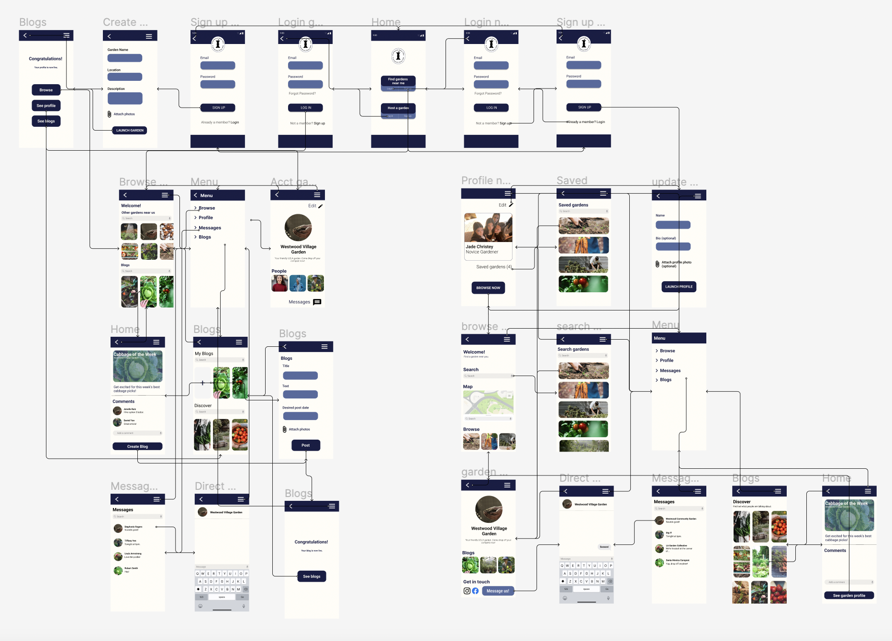
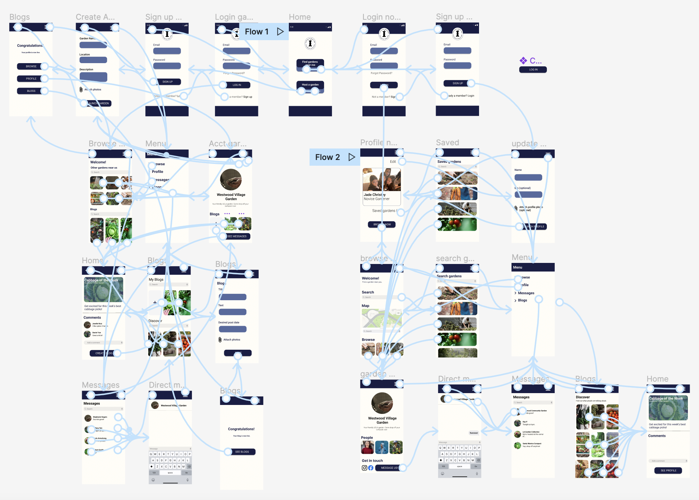

# DH110-22f

## Sustainable Cities | Jade Christey | DH110

### High Fidelity Prototype

#### Brief Description

My projects aims to connect hopeful novice gardeners or composters to local gardens. As well as provide gardeners access to 
publicity and shared community through the app. The high fidelity prototype allows us to see the design in action by integrating interaction. In this way, the wireframe is fully fleshed out with interface design and the flow is in the hands of the user to navigate. 

#### Tasks

I've shown two specific tasks within this interactive prototype. 

##### 1) The first task is to find a local garden and send them a message. 

The interactions included in this task are as follows:

- Login to an account / sign up for an account
- Browse and find a garden
- Find the message function
- Send message

This activity is one that would be done by a novice user in the case that they have a question regarding the garden's resources.

##### 2) The second task is to create an account for a garden and post a blog post. 

The interactions included in this task are as follows:

- Login to an account / sign up for an account
- Navigate to the blog section
- Fill in the necessary information 
- Post

This task would be done on the app by a garden 'founder', probably one that has already visited 
the app and is fairly comfortable with its use. 

#### Wireflow 

The wireflow with interface design is linked [here](https://www.figma.com/file/8Cen20wBb15LwZUE5vPmX7/Prototype-with-design?node-id=0%3A1&t=ZdDpK23g8cB72x8Q-1).

And a screenshot of the flow is attached below. 

#### Interactive Prototype

The interactive prototype linked below supports both tasks outlined. 

Linked [here](https://www.figma.com/file/wSkkQIW5BKMNLSUYTYEqy8/High-Fidelity-Prototype?node-id=0%3A1&t=EY5cyjERzr5a8MTo-1) is the Figma file of the interactive prototype. 

And attached below is a screenshot of the interactive prototype. 

#### Cognitive Walkthrough 

Linked [here](https://docs.google.com/document/d/14FMyDFZLI_7Fc-CzTvAsVBAbB6IKi0I9AtL7StLBAqQ/edit?usp=sharing) are some of the comments from my peers during the cognitive walkthrough. 

**Some of the main points of feedback I got during this exercice and how I corrected them were the following:**
1. Add a logout option within settings menu 

*I added a logout option in the settings menu that sends the user back to the login/signup page*

2. The two login options are confusing, the user may need some additional information (perhaps as a pop-up overlay) 

*I would say this was the biggest structural edit on the app. Instead of seperating the two sections of the app, I made the login/signup page the same and instead opted to have the "Host Garden / Find Gardens" feature be a question option with information added as an overlay to explain which one should be chosen in which scenario*

3. The 'back' option doesn't always lead to the previous page (this is due to multiple frames leading to each other therefore there is no clear back interaction. I did however note in my final presentation of the app that the 'back button' should always lead to the last page the user was on). 

*I made some adjustments to try and make interactions more clearcut so that less pages are leading into a single feature and added a note to my final presentation for developers to have each 'back button' lead to the previous page*

4. The 'Create Blog' button seems inconsistent underneath another account's blog

*I removed this option from the page, instead opting to show more of the comments section so that a user's blogs and that of others' accounts are more distinct*

5. Minor edits regarding pictures not appearing on Figma's preview mode.'

*After some slight adjustments, I was able to fix this issue*

#### Reflection

I ran through a few preliminary "cognitive walkthroughs" with my roommates but as they were in the earlier stages of the development of the high fidelity prototype and quite casual in nature I opted to leave them out. I did however opt to eliminate the 'back' function from the menu feature as having the app navigate the user back to a common page rather than the page you came from originally was quite disorientating so it seemed more straightforeward to have them be more in control of their navigation with the options listed below. I would have prefered the 'back' function navigate the user back to their last active page but I'm not sure how to do that or if it is possible within Figma's prototyping capabilities. I'll be sure to troubleshoot this in class during the cognitive walkthrough. 

I've noted that when previewing the prototype on Figma some elements present in the editing interface design don't appear, I hope this is just due to a delay and that this should be functioning for the cognitive walkthrough in class. 
