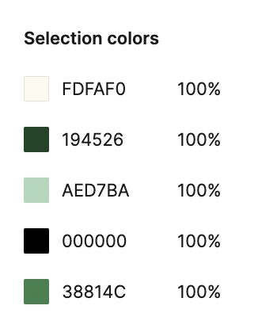
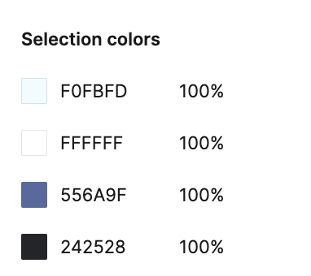

# DH110-22f

## Sustainable Cities | Jade Christey | DH110

### Interface Design

### Project Description
The purpose of this project is connect people searching for places to compost with local/campus compost gardens, so that both can easily find a solution to their issues and contribute to the establishment of a more sustainable community in the process. In doing so I've established wireframes and a wireflow for a few interactions someone may have with the app: setting up either a personal or garden account, locating a local garden, and sending a message. In this page we will delve deeper into the interface design of the app, specifically focusing on font, color, shape, layout and logo placement. 

### Digitized wireflow

Linked [here](https://www.figma.com/file/f2Urjg6UhsWW1nYqiuRrfu/Low-Fidelity-Prototype-(Copy)?t=N67ptB3BXJd7i2wc-1) is the digitized wireflow. 

Linked [here](https://www.figma.com/file/uckCPOY0yeZcXvi8uTZDoO/Interface-design?node-id=0%3A1&t=nVD0BI1lFHK6Ft1f-1) is the Figma file with the design variations shown below. 

### Graphical user interface design variation 

For this portion of the design process I've taken the 'login page' of the app as I believe it will set the tone for how the user will interact with the app as a whole. It is a portion of the site that both the novice user and the expert user would have to initially come into contact with, so it seems to be the perfect page to use as a basis for the interface design of the entire app. 

#### Design

For this portion of the interface design process I used the row and column function of Figma to set up a grid within which I organized the essential elements of the login page. 

#### Color

Here I provided a few color variations both in blue and green tints. 

With the following colors for each color combination: 

##### Green

##### Blue

#### Typography

The following samples use the fonts (from left to right): 

#1: Inter: which is good for online readibility as it was designed specifically for computer screens. 

#2: Open Sens: which is fairly neutral and approachable, with an upright style. 

#3: Roboto Condensed: a more geometric font, that still has some friendly curves. 

All of which are in size 24 and have varied weights associated with them accross the interface based on where the text is and what it is being used to say. 

#### Shape 

The following samples have buttons with varied 'roundedness' – (from left to right):

#1: 20

#2: 5

#3: 0

#### Logo 

The options above give variations of where the logo can be integrated into the interface design. 

### Impression test

Linked [here](https://drive.google.com/drive/folders/1ok9FVkqj3L5891vNIX8O9tQquJb2ofZJ?usp=share_link) is the impression test. 

Based on the impression test, the more rounded button (20), the blue color scheme, the Roboto Condensed font, and the split background logo (last sample) were the preferred options. Attached below (for the accessibility check) is the combination of these options for the final interface. 

### Accessibility check

Pictured above is one of the screenshots of the color contrast accessibility test done on Figma through the Plugin 'Color contrast'. I decided to feature the least glaring contrast to show that it still passes the WCAG AA test. 

### Reflection 

I loved working on interface design variation for this project. I'd be curious to see what the outcome of different impression tests would be, had I gotten more input from others. But I'm fairly happy with the clean-cut look of the final design and feel that it will work seemless with other pages of the app. 
