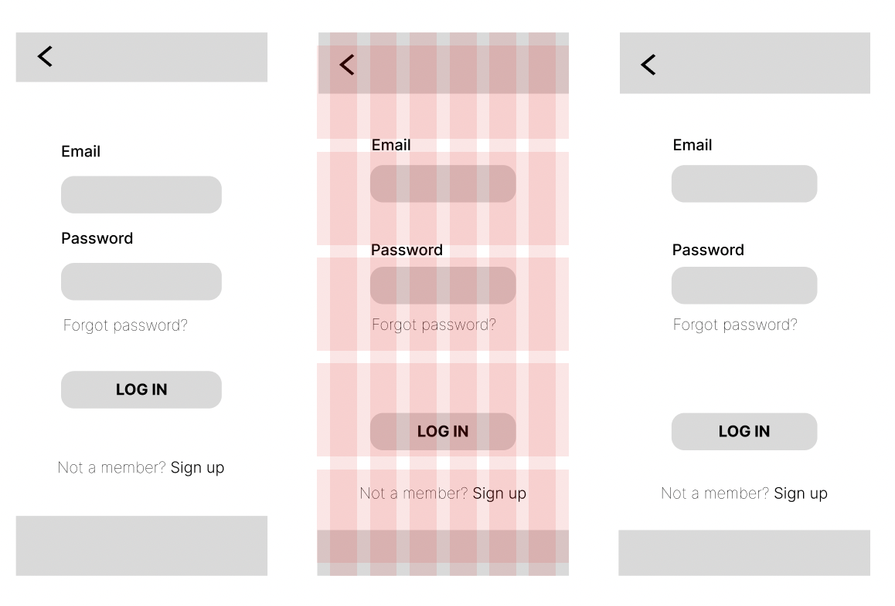
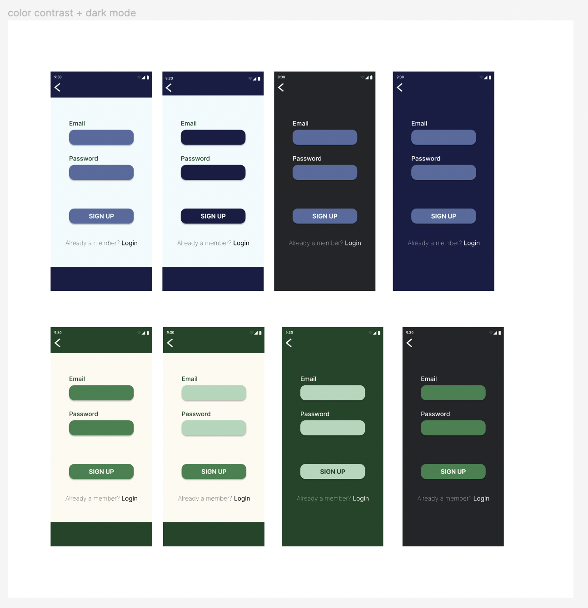
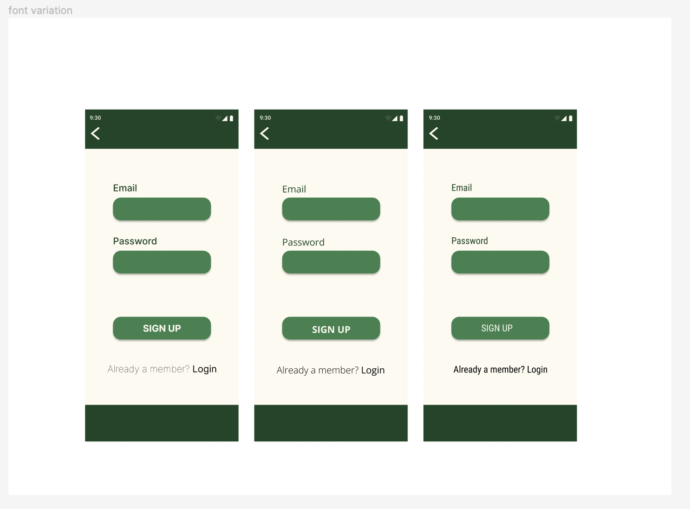
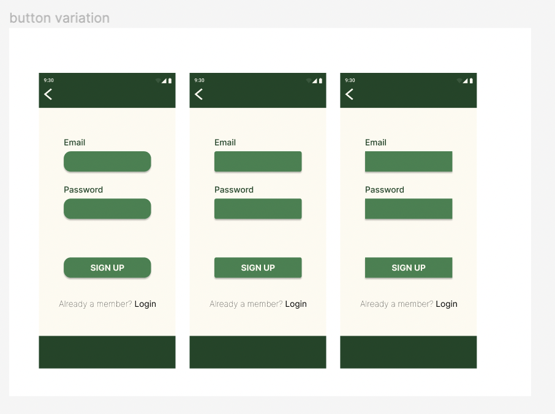
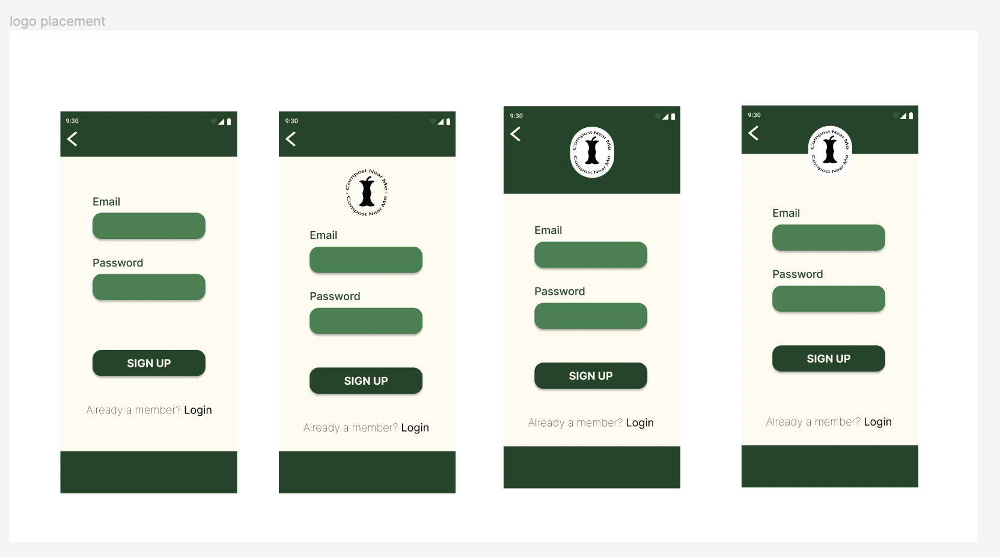
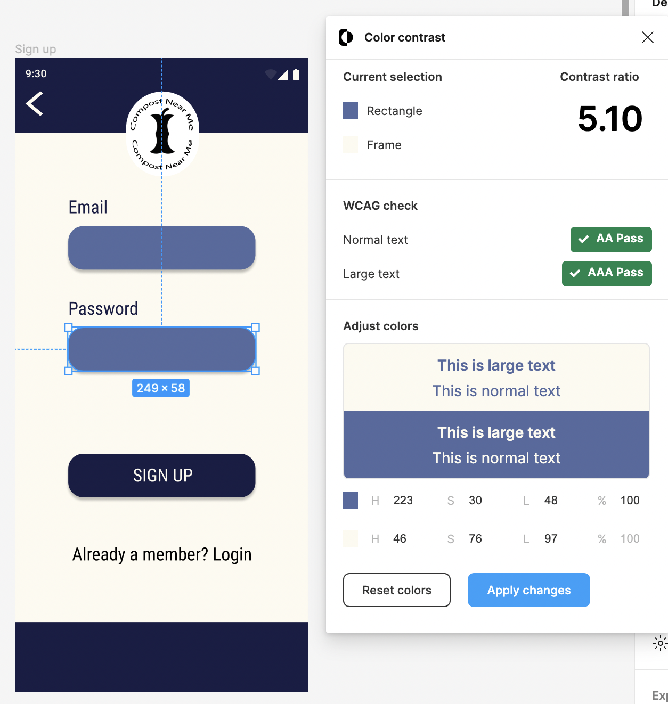

# DH110-22f

## Sustainable Cities | Jade Christey | DH110

### Interface Design

### Project Description
the purpose and process of this interface design (3-5 sentences)

### Digitized wireflow

Linked [here](https://www.figma.com/file/f2Urjg6UhsWW1nYqiuRrfu/Low-Fidelity-Prototype-(Copy)?t=N67ptB3BXJd7i2wc-1) is the digitized wireflow. 

### Graphical user interface design variation 

#### Design

#### Color

#### Typography

#### Shape 

#### Logo 

### Impression test

Linked [here](https://drive.google.com/drive/folders/1ok9FVkqj3L5891vNIX8O9tQquJb2ofZJ?usp=share_link) is the impression test. 

Based on the impression test, the more rounded button, the blue color scheme, the Roboto Condensed font, and the split background logo were the desired 

### Accessibility check

### Final Graphical Interface Design: decision making process 
