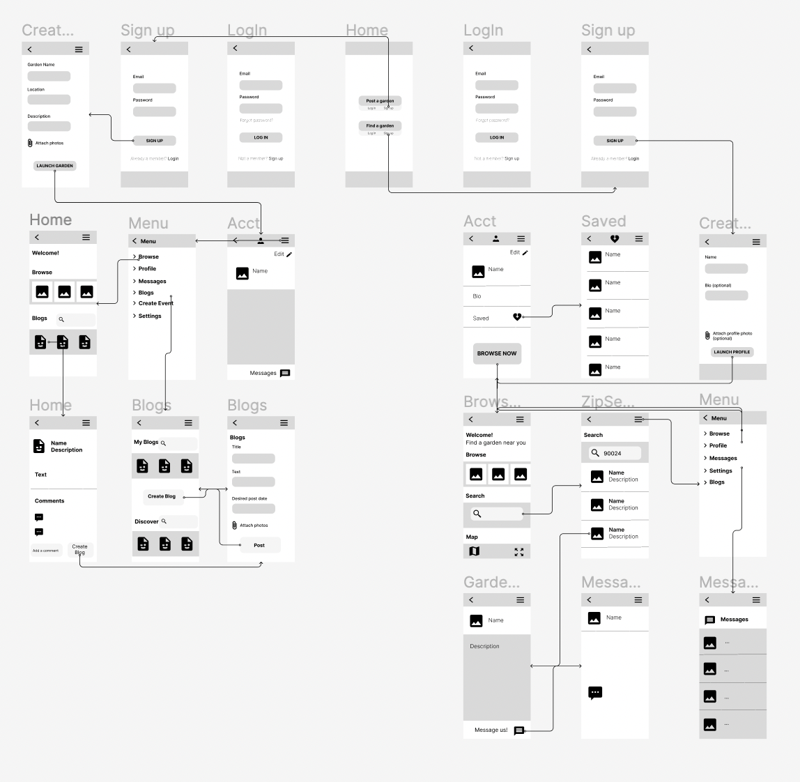
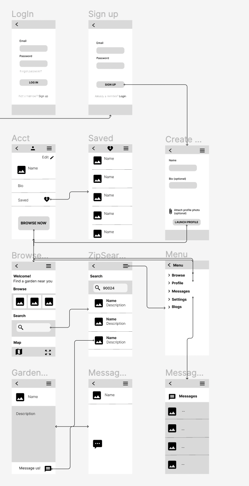
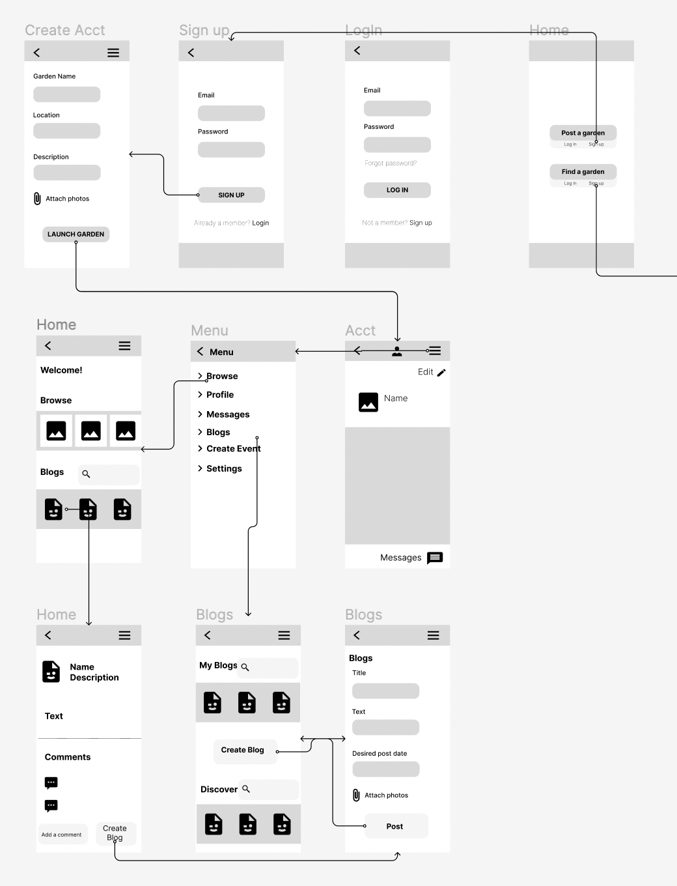

# DH110-22f

## Sustainable Cities | Jade Christey | DH110

### Low Fidelity Prototype

#### Brief Description

#### List of tasks 

1 – The first task is to find a local garden and send them a message. This will consists of quite a few interactions: making an account, using the search bar, selecting a garden, and finding the message function. 

2 - The second task is to create an account for a garden and post a blog post. This task would be done by a garden 'founder on the site' and includes making the account, navigating to the blog section, filling in the necessary information and posting. 

#### The prototype overview 

#### Task 1

#### Task 2

#### Reflection

One thing that was challenging about user testing in the case of a low fidelity prototype was explaining the process to the participant. She hadn't participated in anything like this before and I think having to find the screen that would match a certain action she took wasn't exactly seamless. 
