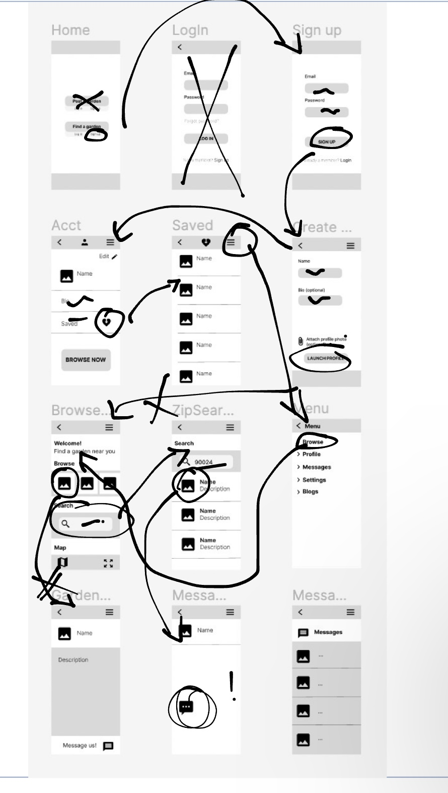
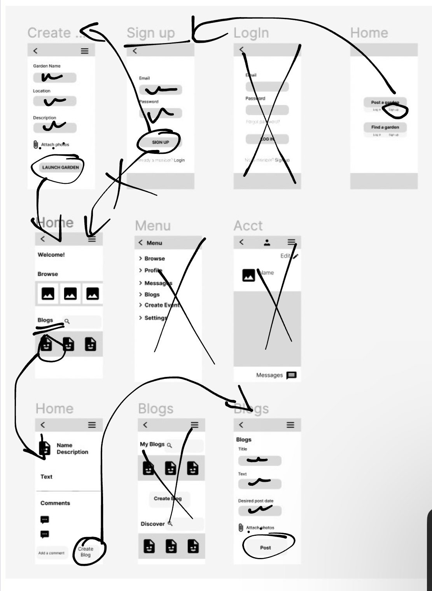

# DH110-22f

## Sustainable Cities | Jade Christey | DH110

### Low Fidelity Prototype

#### Brief Description

The purpose of this app is to connect college-aged students that may not have access to compost and local community/campus gardens. In doing so the gardens can collect and use the compost in a sustainable way and may even recruit new gardeners in the process. 

The user personas I've created with this app in mind were Matt and Rebecca. Matt is a casual user simply looking to find a garden to take his food scraps. Rebecca on the other hand would be a 'founder' meaning she would create a profile for her campus garden in order to gain publicity, recruit and get people to compost more. With these two users in mind, I created two tasks, one of which each would probably engage in.

The role of this low fidelity prototype is to sketch out an idea of different app/website functionality before becoming too concerned with the visual aspect of the app's design. By troubleshooting this process with a user I was able to gain more perspective in terms of what aspects were user-friendly and what I needed to adjust. 

#### List of tasks 

For this project I outlined two tasks that a user may use the app to accomplish:

1 – The first task is to find a local garden and send them a message. This will consists of quite a few interactions: making an account, using the search bar, selecting a garden, and finding the message function. This would be something that a more novice user would do if they had a question about how to utilize the garden's resources. 

2 - The second task is to create an account for a garden and post a blog post. This task would be done on the app by a garden 'founder' and includes making the account and garden profile, navigating to the blog section, filling in the necessary information and posting. 

#### The prototype overview 

*Note: each frame has a 'back arrow' in the top left corner of the screen, when pressed it should navigate to the frame the user was on directly preceeding the current frame.*

I decided to seperate the two tasks from one another as they would have the same initial landing page but the login and account creation sections would be seperate depending on the user, with 'founders' have more functions availible to them than someone who is simply a guest on the app. As to not confuse the my user (in the case of the user test of this prototype) I elected to seperate these two flows. 

#### Task 1

#### Task 2

#### Testing the tasks

Attached below are screenshots of the user's flow arrows. Attached [here](https://drive.google.com/drive/folders/1PqkHco8QMXvWrrW_XU9dZKQ4U_-YwN0x?usp=share_link) is the screenrecording of this process. 

*Note the user crossed out frames throughout their navigation of the system. I asked them to do that throughout the process to keep track of which functions they thought were unecessary in the completion of the final task. Because I wanted the app to support a 'login' and 'sign up' function, I included both frames in the prototype, however, as the task directed the user to create an account, they opted to use the 'sign up' function and didn't need to access the 'login' page.*

##### Task 1

##### Task 2

#### Reflection

One thing that was challenging about user testing in the case of a low fidelity prototype was explaining the process to the participant. She hadn't participated in anything like this before and I think having to find the screen that would match a certain action she took wasn't exactly seamless. Another issue I encountered in this step was that my user didn't necessarily know what was and wasn't clickable in my prototype and thus had to double-check what she could and couldn't access from a given page. 

Some notes that I plan on changing based on her feedback was: 

1 – I noticed that she preffered the 'browse' function over accessing the menu to find what she was looking for. Because of this, after the creation of an account, the user should be led to a welcome page as opposed to having to navigate to the menu in order to access other functions. This will improve clarity and give them more direct access to the sections of the app they desire to access. 

2 – There was also some initial confusion regarding the phrasing of the home page buttons: "Post a garden" and "Find a garden". This may need some reworking in terms of UX writing, so that users quickly know which area of the site applies to their situation. 

