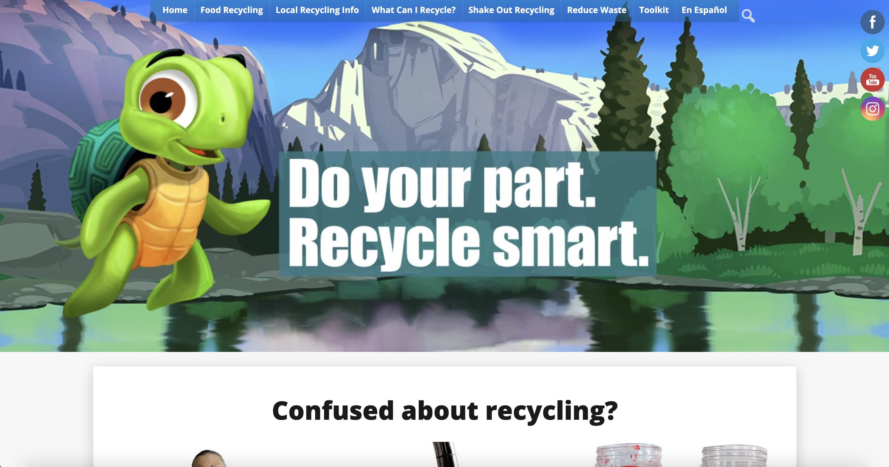
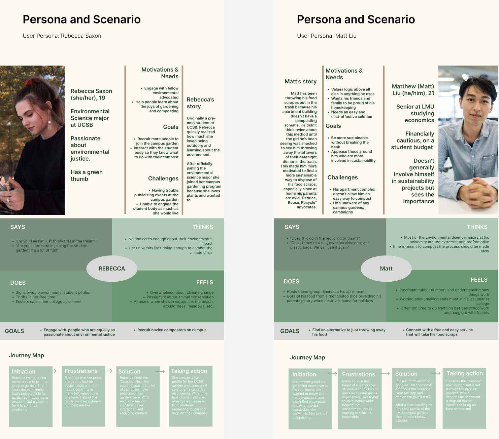
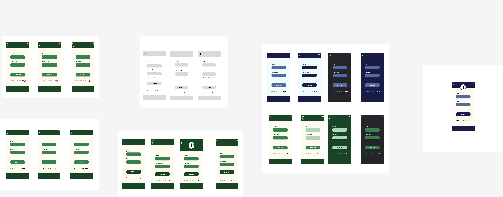
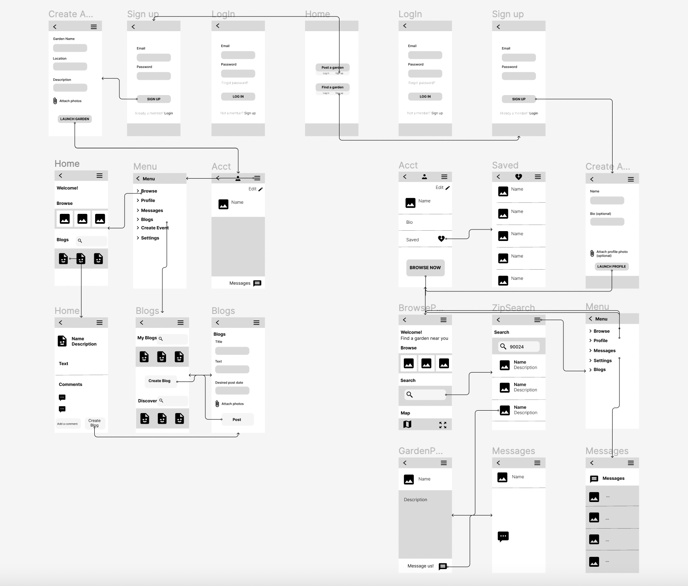
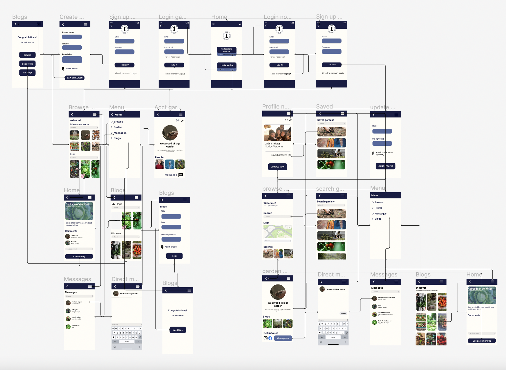
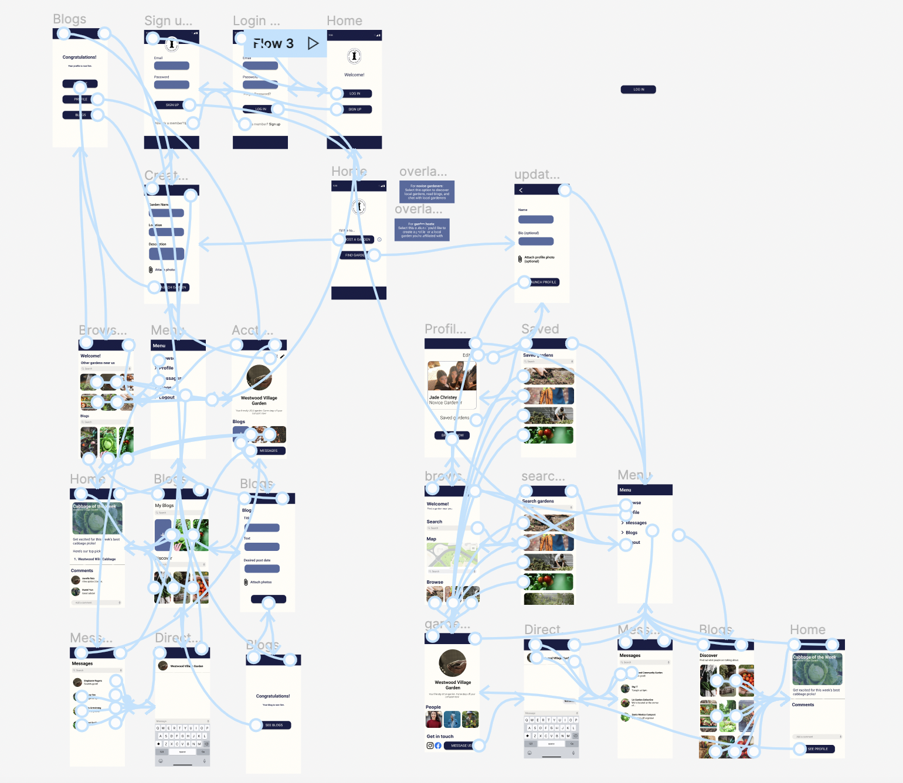
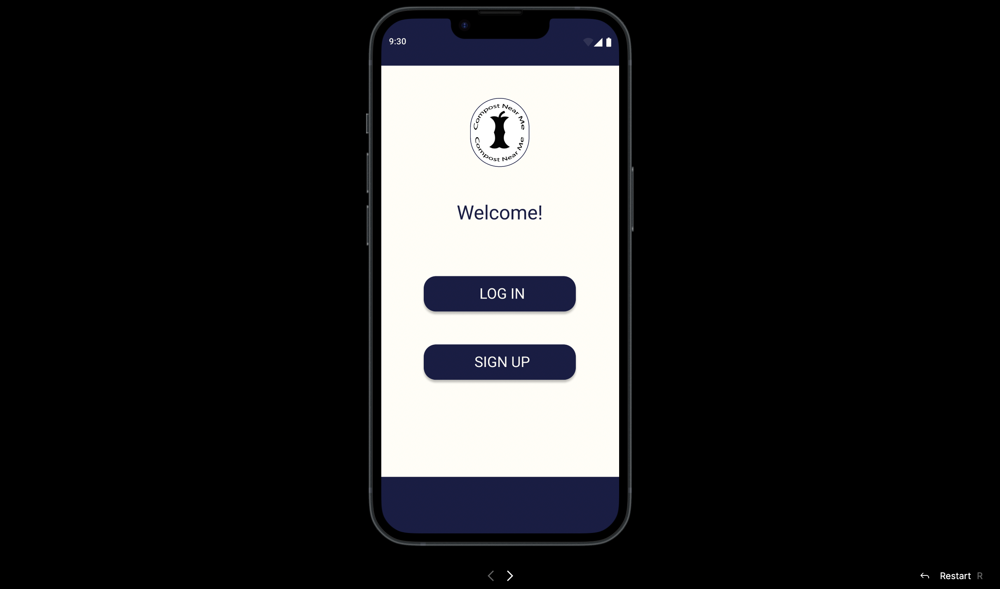

# Compost Near Me

## Jade Christey, DH110 UX+UI design, 2022 Fall 

### Introduction
Since becoming a citizen of Westwood and moving off of the UCLA campus, I've found that a lot of the neighborhood’s apartment buildings don't provide sufficient means to dispose of compost. In line with the Sustainable Development goal: Sustainable Cities, I'm hoping to propose a platform on which users can find local spaces (community gardens, compost sites, etc) to dispose of their food waste in sustainable ways. 

### Design Statement 
After a series of tests and trials, I determined that community gardens are missing a sufficient online platform from which they can publicize to the public and share amongst expert users. This platform fills a need by garden hosts to update the community on recent endeavors, communicate with potential gardeners and composters, post blogs and interact with other garden leaders. More novice users on the other hand can use the app to find gardens near them, learn about ways to compost, and connect with others looking to do the same. By uniting people with similar desires for environmental justice, this platform searches to make communities more sustainable by increasing the public accessibility and online presence of existing community gardens. 

### Competitor analysis: Heuristic Evaluation

I conducted heuristic evaluations of the sites IRecycleSmart and LACompost to see the current UX issues of sites related to recycling and compost. In doing so I learned more about the desires of the user, what they did and didn’t respond well to and how they prefer to interact with these types of online resources. Read more about this [heuristic evaluation](https://github.com/jchristey/DH110-22f/tree/main/assignment1).

| IRecycleSmart Website | CompostLA Website |
| ------------- | ------------- |
|  |   |

### Competitor Analysis: Usability Test 

I also conducted usability testing with the IRecycleSmart site. In my heuristic evaluation I found that the site could use some improvement in terms of user control & freedom as well as flexibility and efficiency of use. Because of this, in this specific UT I wanted to observe how the user found less prominent features of the site, such as the "grass clippings" section, the drop-off mandated items section and the city lookup function, in order to complete tasks related to finding what they can recycle and how to do so. Read more on my [usability test](https://github.com/jchristey/DH110-22f/tree/main/PilotUT).

### User Research: Contextual Inquiry
I also conducted user research with target users. I was particularly curious as to the process of composting on campus. I narrowed down a student initiative on campus which encourages students to get involved in gardening; the initiative is called DigUCLA. The garden located in Sunset Rec hosts weekly gardening workshops, welcomes gardeners of all experience levels and all the produce grown is donated to the CPO Food Closet. I used research into this garden as an example of how best to integrate this app into the existing landscape of local composting. Read more about [user research](https://github.com/jchristey/DH110-22f/blob/main/PeopleInContext/README.md).

|Picture of UCLA Community Garden (angle 1)|Picture of UCLA Community Garden (angle 2)|
|---|---|
|||

### UX Storytelling

I made two user personas to represent the target users of this app. Through this storytelling process I was able to create target users that are similar in geographic area (on and around college campuses) and age and education level (current college students), yet differ in their level of engagement with environmental issues and involvement within university composting initiatives. Thanks to this, I was able to create a more distinct picture of who is using different features of the app and how best to design processes that are clear to these specific sets of users. Read more about these [user personas](https://github.com/jchristey/DH110-22f/blob/main/UserPersonas/README.md).

| User Personas and Empathy & Journey Maps |
| ------------- | 
|  |

### Interface Design

I've also established some design iterations of this app. For this portion of the design process I've taken the 'login page' of the app as I believe it will set the tone for how the user will interact with the app as a whole. It is a portion of the site that both the novice user and the expert user would have to initially come into contact with, so it seems to be the perfect page to use as a basis for the interface design of the entire app. Read more about the [interface design](https://github.com/jchristey/DH110-22f/blob/main/InterfaceDesignSystem/README.md).

| Breakdown of Interface Design Elements |
| ------------- | 
|  |

### Low Fidelity Prototype

I made a low fidelity prototype in order to troubleshoot interaction issues. This prototype supports two main tasks a user would use the app to accomplish: messaging a garden and creating a blog. Read more about the [low fidelity prototype](https://github.com/jchristey/DH110-22f/blob/main/LowFidelityProto/README.md).

| Low Fidelity Prototype |
| ------------- | 
|  |

### High Fidelity Prototype

After troubleshooting and reworking the low fidelity prototype's interactions based on usability testing and adding in interface design elements, I made a high fidelity prototype This prototype supported the same tasks as the low fidelity prototype with additional interactions to aid user flow and make the user interface more engaging. Read more about the  [high fidelity prototype](https://github.com/jchristey/DH110-22f/blob/main/HighFidelityPrototype/README.md).

| Early High Fidelity Prototype | Final High Fidelity Prototype (with interactions shown) |
| ------------- | ------------- |
|  |   |

### Evaluation 

Throughout the design process I continuously conducted user testing to gain valuable feedback. Luckily the target users for this app were college students so I was easily able to survey my roommates and classmates. After the cognitive walkthrough with my classmates I conducted two usability tests with users from the target user demographic. 

Linked [here](https://drive.google.com/drive/folders/1WOAuXySPIomjBzXY3a8luFIbq9x1qSMx?usp=share_link) are the video recordings of the usability tests. 

I learned some very important things from these tests, allowing me to better my final product. 

The first one I administered shed some light on the interactions between pages. While editing some components based off of the notes from the cognitive walkthrough some of the interactions had been mixed and thus led to the wrong pages, I was able to take a closer look at these and fix them to make the flow more logical. 

After having made these edits I conducted the second usability test which illuminated a further need to distinguish between the 'Host a garden' and 'Find gardens near me' buttons. For this test I had to direct the user back to these options and put specific focus on which one she should choose for which task. After the usability test the user did say that she felt she was too hasty and that's why she missed these. I did however adjust the color of the information button to further encourage the user to use it to gain further information. Other than this the user was able to quickly find all other functions. 

### Presentation 

^ Please click above to view my project pitch. 

### Conclusion

Through this design process I’ve developed a new passion for UX/UI which I barely realized was a path prior to having taken this course. I was empowered by my ability to use skills that I’ve developed from various different endeavors: qualitative research, design principles, critical thinking and continual tweaking of different aspects to come to a fine-tuned final product. Finally, I’m proud to have participated in a design process that aims to make the world a better place – in my case, specifically through designing a platform on which users can unite to locate spaces that ameliorate not only their composting process but also contribute to a sustainable method of growing vegetables and contributing to their local community. 
