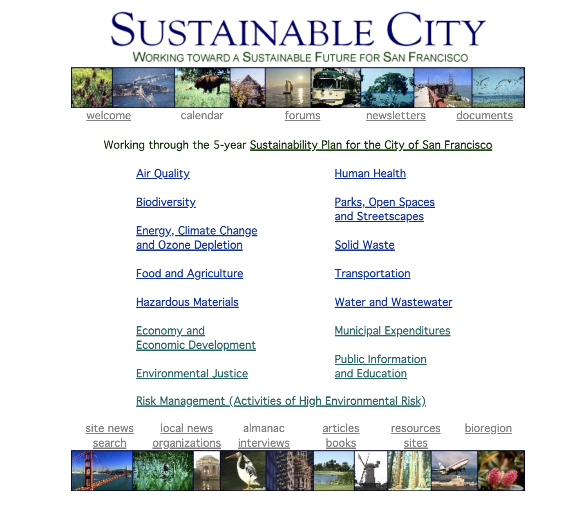

# DH110-22f

## Sustainable Cities

### Jade Christey – DH110

Since becoming a citizen of Westwood and moving off of the UCLA campus, I've found that a lot of Westwood apartment buildings don't provide succificient means to dispose of compost. In line with the Sustainable Devolpment goal: Sustainable Cities, I'm hoping to propose a platform on which users can find local spaces (community gardens, compost sites, etc) to dispose of their food waste in sustainable ways. 

The sites I've chosen to analyze for this project shed light on the current state of compost/recycling in LA/California. 

