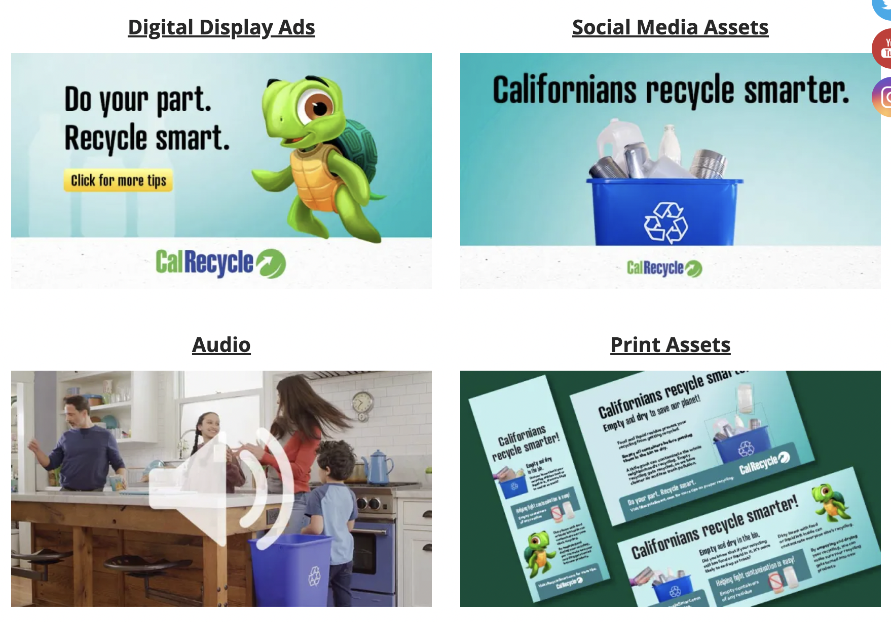
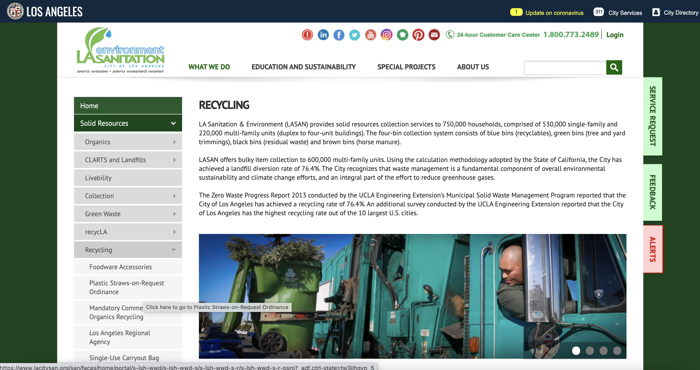
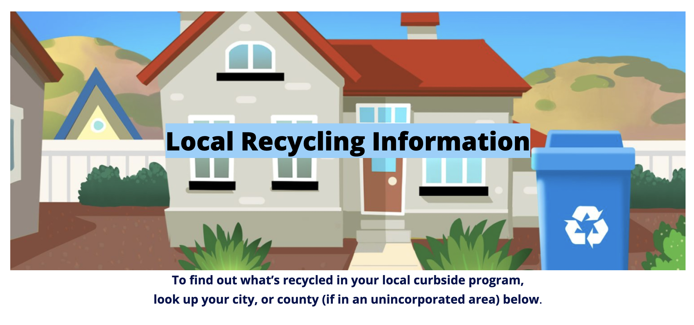
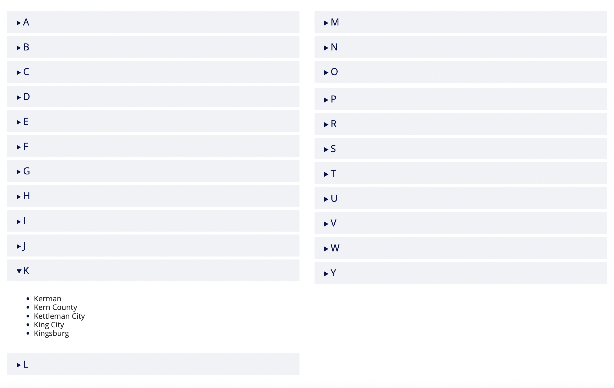
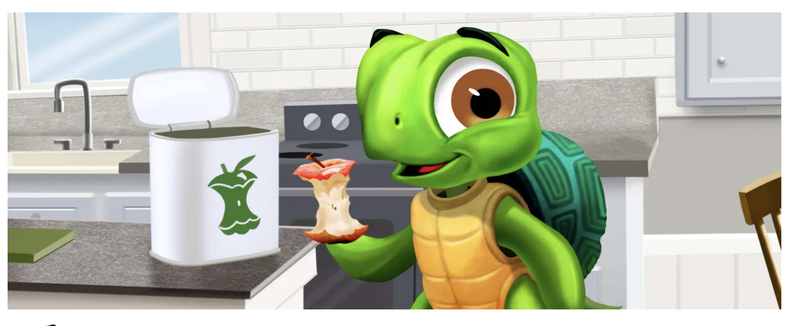
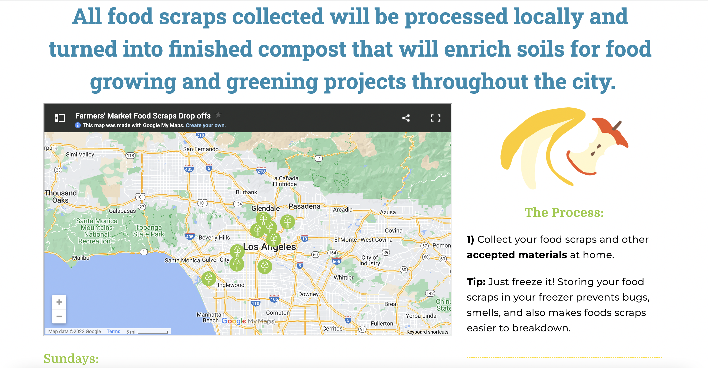
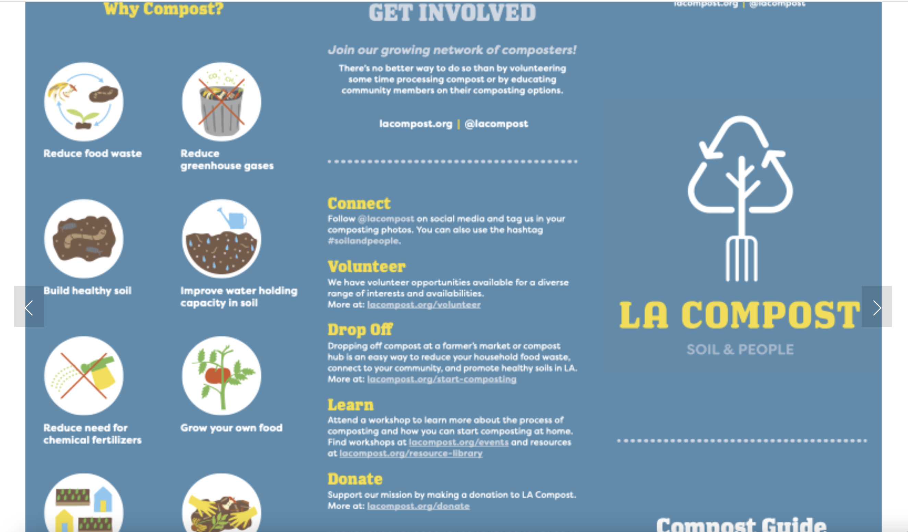

# DH110-22f

## Sustainable Cities | Jade Christey | DH110

### Project Proposal

Since becoming a citizen of Westwood and moving off of the UCLA campus, I've found that a lot of Westwood apartment buildings don't provide succificient means to dispose of compost. In line with the Sustainable Devolpment goal: Sustainable Cities, I'm hoping to propose a platform on which users can find local spaces (community gardens, compost sites, etc) to dispose of their food waste in sustainable ways. 

The sites I've chosen to analyze for this project shed light on the current state of compost and recycling in California more generally, and LA more specifically.

### Severity Ratings in Heuristic Evaluation 

1 = Cosmetic problem only: need not be fixed unless extra time is available on project

2 = Minor usability problem: fixing this should be given low priority

3 = Major usability problem: important to fix, so should be given high priority

### First Site: IRecycleSmart

https://irecyclesmart.com/organics/?gclid=CjwKCAjws--ZBhAXEiwAv-RNL3ui9vpE_2HkgzaXuG6bMstDJ6OA0oDMZgT97EETUh3T09LdSFYaRRoC7csQAvD_BwE 

This site covers elements that are and are not recyclable as well as local information regarding recycling more generally. The design of the site seems to indicate that it could be used for educating young children about these concepts, as there is a cartoon turtle present throughout. Though rudimentary in some elements the site is succesful in its intention to provide direct contact with information regarding what can and cannot be recycled. 

#### 1: Visibility of System Status

When scrolling down the page the user loses sight of the menu bar and the title of the page they are currently accessing. This may lead to confusion as to what information they are looking at and what stage of the site they are in. **(1)**

*Recommendation: Have the menu bar follow the user as they scroll down the page to easily change tabs while reading. Indicate the page you are currently on in the menu bar through changing the color or boldness.* 

#### 2: Match between System and the Real World

Some of the terms employed may be out of the users’ vocabulary, especially for young users terms such as “Digital Display Ads” and “Social Media and Print Assets” may not be in their wheelhouse. **(3)**

*Recommendation: Make a section of the site clearly designated for children users to explore and interact with the material and a section of the site intended for adult users to gain access to said educational materials.*

#### 3: User Control and Freedom

User can fairly easily navigate back towards the main menu when clicking on any element of the site. Some confusion may come from links leading to new sites (such as the local recycling information pages), in this case users can no longer see menu bar and must navigate back to main site. **(2)**

Example of an external folder linked on the site.

*Recommendation: Clearly indicate when user will be directed to another site and make this disctinct among links.*

#### 4: Consistency and Standards

There are links to relevant pages used throughout the site – however, It is not clearly indicated what the link is going to lead to (i.e. external tabs, Google Drives, or other sections of the site. The user may become frustrated by consistently being led to external tabs. **(2)**

*Recommendation: Clearly indicate what a link will lead the user to as well as the information they will find there.*  

#### 5: Error Prevention

Error prevention is successful. I didn’t encounter any error messaging. **(0)**

*No improvements.*

#### 6: Recognition Rather than Recall

In the “Local Recycling Information” section of the site the description reads “To find out what’s recycled in your local curbside program, look up your city, or county (if in an unincorporated area) below”. However, the links lead directly to external city sites. Each site has their own organization and the user may find it difficult to remember that they are searching for “what’s recycled” **(2)**

*Recommendation: Change the text to “Learn more about recycling in your community”, to reduce users’ need to go back to the launch page to remember what they are searching for on this separately linked site. Or incorporate the information from said communities into the site itself (note: this, however, would need to be updated regularly)*

#### 7: Flexibility and Efficiency of Use

In the “Local Recycling Information” section of the site the cities are listed in section by first letter in alphabetical order, making it a fairly long process to find your city. **(2)**

*Recommendation: Incorporate an internal search bar for either city name or zip code in order to streamline the process of finding local guidelines.*

#### 8: Aesthetic and Minimalist Design

The design of the site seems to be appropriate for their target audience, as the more colorful interface seems to be geared towards keeping children engaged in the content of the site. **(2)**

*Recommendation: Include more interactive elements to further cater to a younger audience and make a more effective educational tool (i.e. allowing user to move items into appropriate bins, etc)*

#### 9: Recognize, Diagnose, and Recover from Errors

Search bar error message is concise and constructive. However through some trials it does seem to not pick up on misspelled terms or inconcise searches. **(1)**

*Recommendation: Provide suggestions for misspelled words/related ideas.*

#### 10: Help and Documentation

There is no designated “Help” section of the site. If a user is confused on how to navigate certain elements they are not guided. **(1)**

*Recommendation: Incorporate a help icon or a FAQs section into the menu bar for users looking to learn more.*

### Second site: LACompost

https://www.lacompost.org/start-composting 

The next site I’ve analyzed is more aligned in terms of what my intended project will do (locating spaces near you to compost food waste). The website is successful in conveying the necessary information with little to no issues. However, the user could be given more freedom and the design could be adjusted to better reflect their intentions and ameliorate the user's experience.

#### 1: Visibility of System Status

When a user selects “View all available locations” they are brought to other educational pamphlets before the map of locations. This makes for a disconnect between what the user wants to see and what they are being shown. **(2)**

*Recommendation: Lead users directly to an interactive map of locations and provide other information secondarily (perhaps as a legend in the map).*

#### 2: Match between System and the Real World

The site uses easily comprehensible visual elements as well as vocabulary to convey their intended message. **(0)**

*No improvements.*

#### 3: User Control and Freedom

When users click on the Shop page of the site they are led to an external site on a separate tab. They need to change tabs again to get back to the original site. **(1)**

*Recommendation: If possible incorporate the Shop portion into the main site opposed to having a separate website that is externally linked.*

#### 4: Consistency and Standards

“About” section is located first in the menu bar rather than a “Home” section or the page dedicated to the practical intention of the site. **(1)**

*Recommendation: Move about section closer to the end of menu bar.*

#### 5: Error Prevention

No errors encountered. **(0)**

*No improvements.*

#### 6: Recognition Rather than Recall

The menu bar doesn’t indicate which page the user is currently reading so the user may get confused when scrolling down the page as to what part of the site they are on. **(1)**

*Recommendation: Have the menu bar indicate which page of the site the user is accessing at that moment.*

#### 7: Flexibility and Efficiency of Use

There is a “Jump Straight to Farmers Market” option for those looking for easy access to the map view of location sites. However, in order to use this function one would have to have sufficient knowledge of what it is they are searching for (i.e. a “farmers’ market” as opposed to a “drop off site” or other term). Additionally, there is no search bar apparent on the site. Users have to manually navigate. **(2)**

*Recommendation: Add a search bar to help users navigate the site more quickly.*

#### 8: Aesthetic and Minimalist Design

PDF documents are uploaded on the site for further information. However, the size shown is too zoomed in and doesn’t allow the user to adjust viewing size unless it is downloaded. Additionally, some PDFs uploaded are blurry. **(2)**

*Recommendation: Allow users to view PDF at desired size on the site itself. And improve image quality of documents uploaded.*

#### 9: Recognize, Diagnose, and Recover from Errors

N/a. No error messages encountered. **(0)**

*No improvements.*

#### 10: Help and Documentation

No FAQ section or Help documentation. **(1)**

*Recommendation: Add a “Frequently Asked Questions” section for additional help and information. And possibly a chat box in order to help users in need of additional information.*

